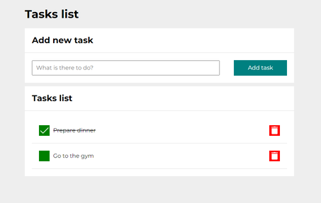

# task-list

## *[To-do list app](https://adrode.github.io/task-list/)*

You can add tasks to your to-do list. You can also mark tasks as done and remove any tasks from the list.

Tasks are added to the list using JavaScript. The code retrieves the text content from input after clicking the "Add task" button, passes it to the render() function, which displays the list items in the form of: buttons for marking tasks as completed, content of the task added to the list, button for removing the task.

### Technologies used:
- HTML
    - BEM convention
    - Webpage Icon
- CSS
    - Flex / Grid
    - Background images
- JS
    - Arrow functions
    - .addEventListener() method
    - Arrays
    - Objects